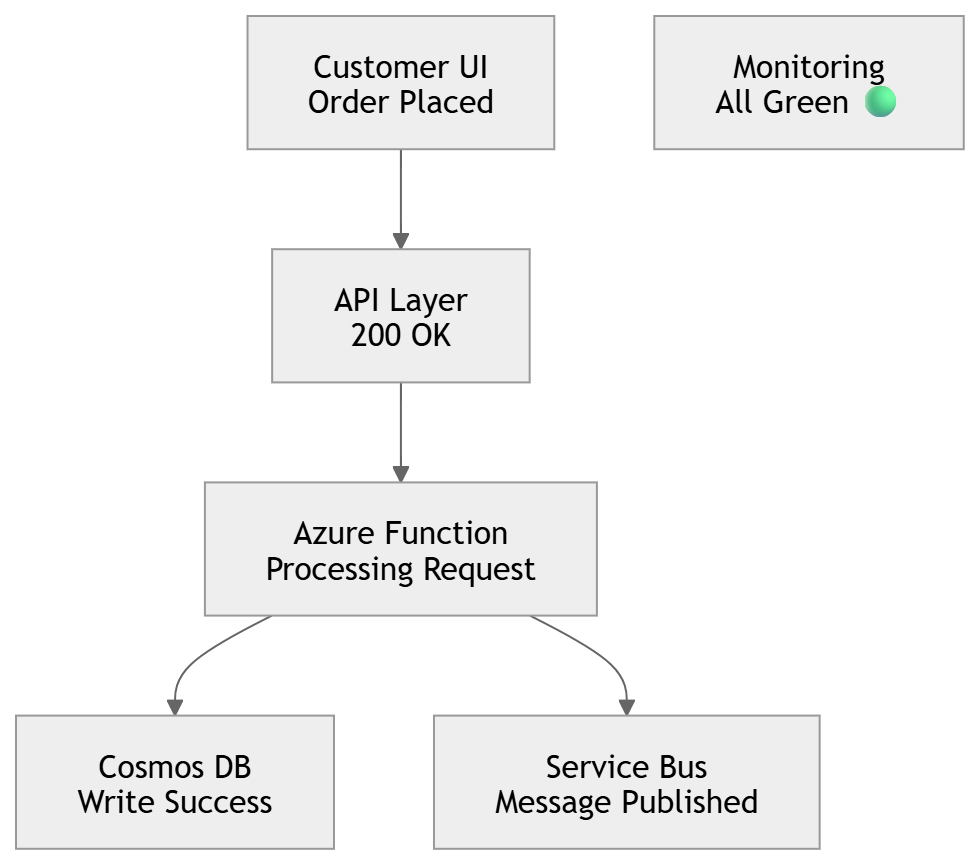
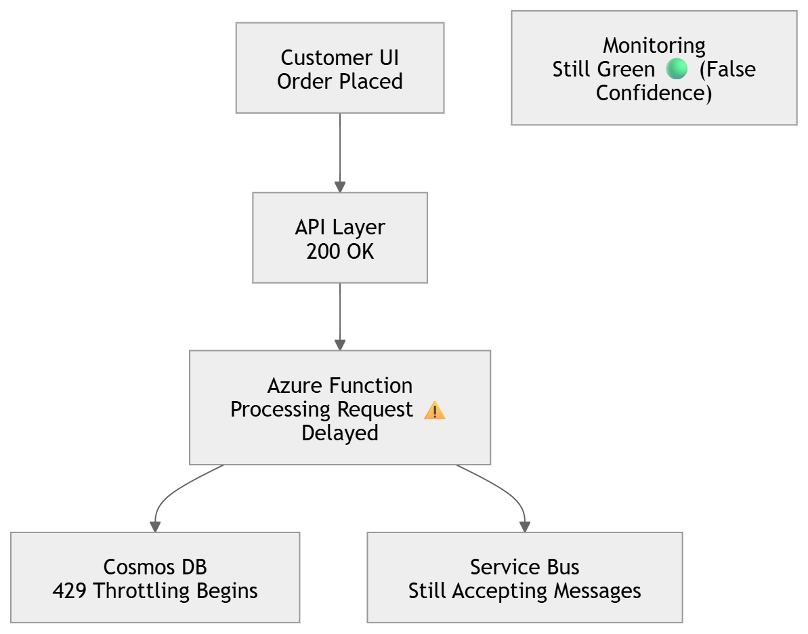
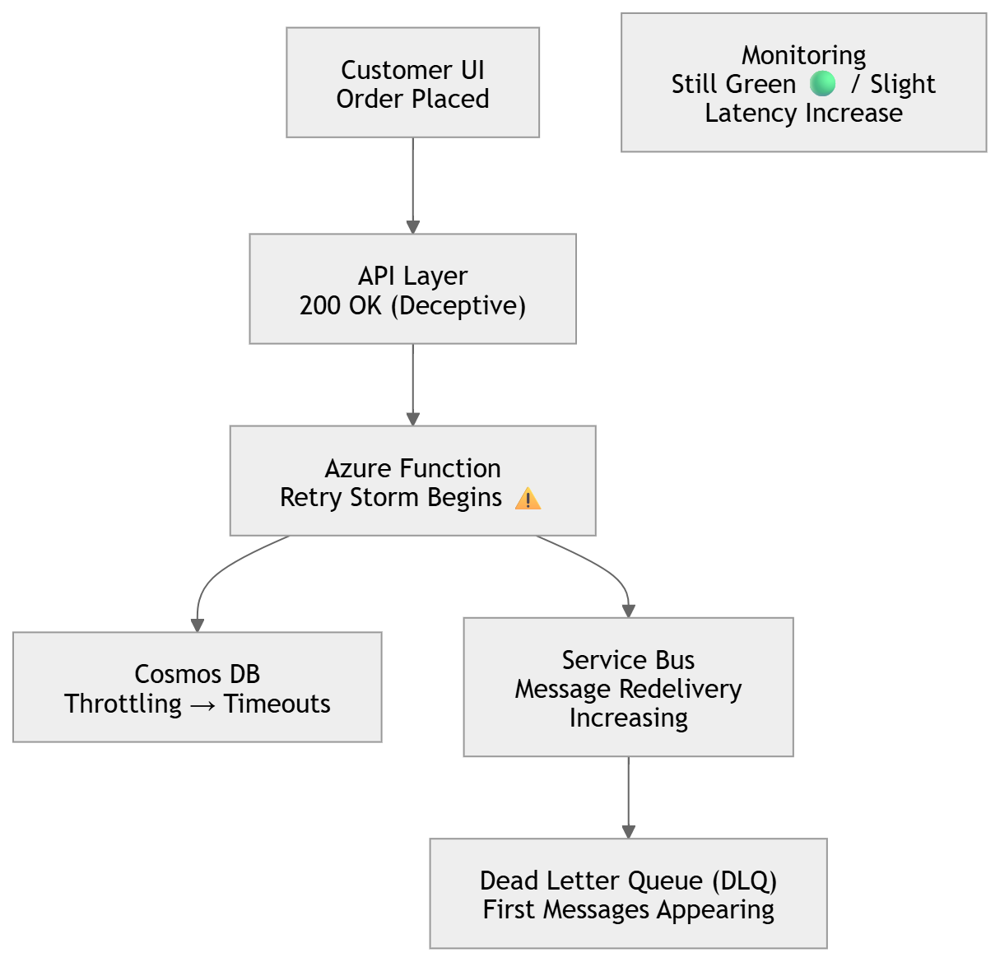
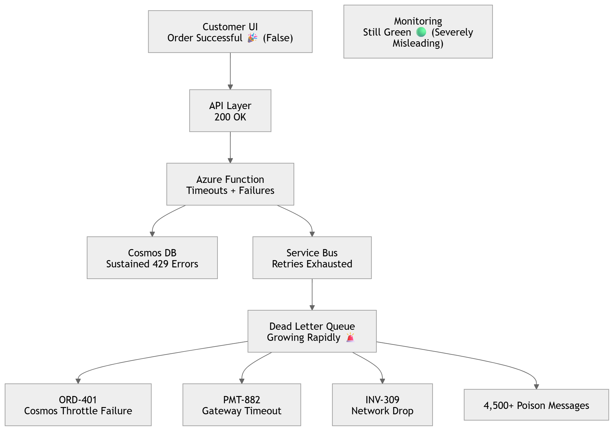

# 🧊 Azure Architecture Iceberg — Animated Failure Propagation (Step-by-Step)

## 🟢 STEP 1 — Normal Operation (Everything Looks Healthy)

* 👉 Reality: System is fully operational
* 👉 Observation: Dashboards show no issues

---

## 🟡 STEP 2 — First Failure Appears (Invisible Degradation Starts)

* 👉 Reality: Cosmos DB is throttling (429s)
* 👉 Observation: No alerts fired yet
* 👉 Key Insight: Failure is non-blocking but accumulating

---

## 🟠 STEP 3 — Cascade Begins (Retries + Timeouts Triggered)

* 👉 Reality:

* Retry amplification starts
* Function execution time increases
* Service Bus starts re-delivery loops

* 👉 Critical Moment: system is already unstable

---

🔴 STEP 4 — Failure Propagation (System Breakdown Escalates)

* 👉 Reality:

* DLQ explosion
* Poison message accumulation
* System is partially degraded but not detected properly