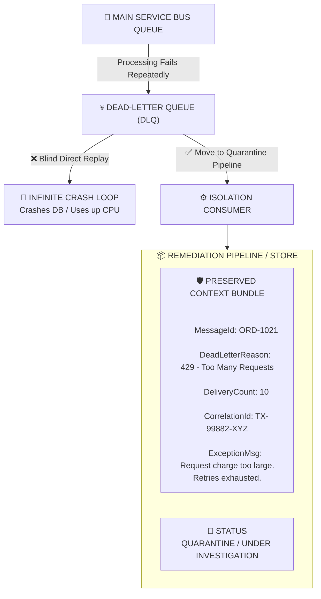
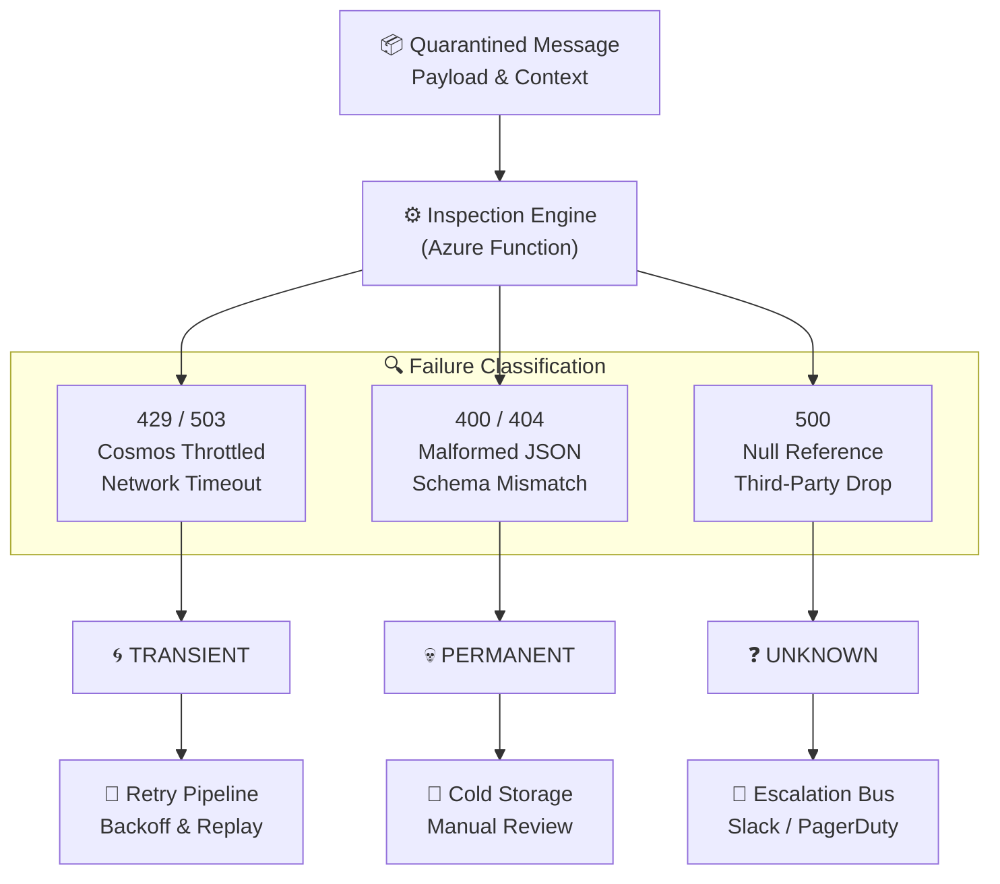
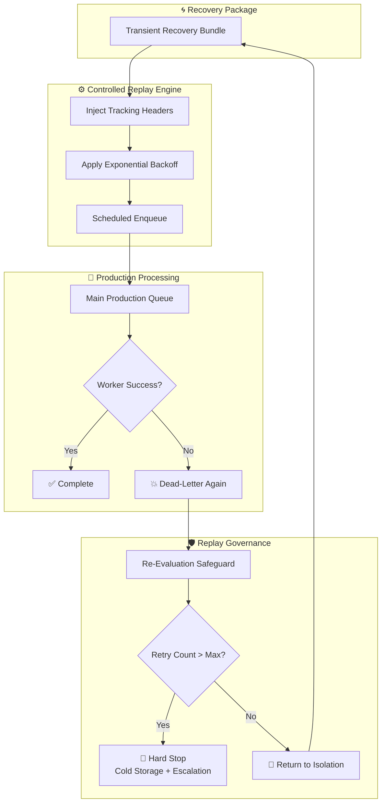

# Azure Service Bus DLQ Self-Healing

Production-grade Azure Service Bus Dead Letter Queue (DLQ) remediation using Azure Functions, retry intelligence, and automated recovery patterns.

---

# Why This Repository Exists

Most Azure Service Bus tutorials teach you how to:

* Send messages
* Receive messages
* Dead-letter messages

Very few teach you how to recover safely once messages reach the Dead Letter Queue.

In production systems, dead-lettered messages often represent:

* Lost orders
* Missing payments
* Incomplete workflows
* Failed integrations
* Silent business failures

This repository demonstrates a production-grade self-healing architecture using the:

**Isolate → Inspect → Controlled Requeue Pattern**

---

# Architecture

```text
                      ┌─────────────┐
                      │ Main Queue  │
                      └──────┬──────┘
                             │
                             ▼
                     Order Processor
                             │
                       Processing Fails
                             │
                             ▼
                ┌─────────────────────────┐
                │ Dead Letter Queue (DLQ) │
                └─────────────┬───────────┘
                              │
                              ▼
                    DLQ Inspector Function
                              │
                  ┌───────────┴───────────┐
                  │                       │
                  ▼                       ▼
            Requeue Message       Archive Message
            (Transient)           (Poison / Max Retry)
```

---

# Solution Structure

```text
src/
│
├── Functions/
│   ├── OrderProcessorFunction.cs
│   ├── DlqInspectorFunction.cs
│
├── Services/
│   ├── IsolateService.cs
│   ├── InspectService.cs
│   ├── ControlledRequeueService.cs
│   ├── BlobArchiveService.cs
│
├── Models/
│   ├── OrderMessage.cs
│   ├── RemediationEnvelope.cs
│   ├── InspectionResult.cs
│   ├── FailureType.cs
│
├── Constants/
│   ├── HeaderKeys.cs
│
└── local.settings.json
```

---

# Azure Resources Required

Create the following Azure resources:

1. Azure Service Bus Namespace
2. Azure Service Bus Queue
3. Azure Function App (.NET 8 Isolated)
4. Azure Storage Account
5. Blob Container
6. Application Insights

---

# Queue Configuration

Queue Name:

```text
orders
```

Recommended Demo Settings:

```text
MaxDeliveryCount = 3
LockDuration     = 1 Minute
```

Why?

A low MaxDeliveryCount allows viewers to quickly observe messages moving into the Dead Letter Queue.

---

# Dead Letter Queue Path

Azure Service Bus automatically exposes:

```text
orders/$deadletterqueue
```

This is the queue monitored by:

```text
DlqInspectorFunction
```

---

# The 3-Step Detective Pattern

## Step 1 — Isolate

Preserve:

* MessageId
* DeadLetterReason
* DeliveryCount
* Retry Metadata
* Correlation Id

before making any recovery decisions.

Responsible Component:

```text
IsolateService.cs
```

---

## Step 2 — Inspect

Classify the failure.

Possible outcomes:

```text
Transient
Poison
Unknown
```

Responsible Component:

```text
InspectService.cs
```

---

## Step 3 — Controlled Requeue

If recoverable:

```text
Retry Safely
```

Otherwise:

```text
Archive Permanently
```

Responsible Component:

```text
ControlledRequeueService.cs
```

---

# Order Processing Function

The repository includes:

```text
OrderProcessorFunction.cs
```

This function intentionally generates failures so the DLQ remediation workflow can be demonstrated.

Supported scenarios:

```text
Timeout
429 Rate Limit
Poison Message
```

---

# Demo Scenario 1 — Timeout

Send:

```json
{
  "OrderId": "1001",
  "FailureType": "Timeout"
}
```

Flow:

```text
Main Queue
   ↓
TimeoutException
   ↓
Service Bus Retry
   ↓
MaxDeliveryCount Reached
   ↓
DLQ
   ↓
Inspector
   ↓
Transient
   ↓
Requeue
```

Expected Result:

```text
Message returned to main queue
```

---

# Demo Scenario 2 — HTTP 429

Send:

```json
{
  "OrderId": "1002",
  "FailureType": "429"
}
```

Flow:

```text
Main Queue
   ↓
429 Exception
   ↓
DLQ
   ↓
Inspector
   ↓
Transient
   ↓
Retry Count Incremented
   ↓
Requeue
```

After remediation retries exceed threshold:

```text
Archive
```

Expected Result:

```text
Blob Storage Archive
```

---

# Demo Scenario 3 — Poison Message

Send:

```json
{
  "OrderId": "1003",
  "FailureType": "Poison",
  "CustomerId": "INVALID_DATA"
}
```

Flow:

```text
Main Queue
   ↓
InvalidDataException
   ↓
DLQ
   ↓
Inspector
   ↓
Poison Classification
   ↓
Archive Immediately
```

Expected Result:

```text
Blob Storage Archive
```

---

# Retry Metadata

Controlled retries use a custom application property:

```text
X-Remediation-Retry-Count
```

Example:

```text
X-Remediation-Retry-Count = 1
```

Every successful remediation replay increments this value.

This prevents:

* Infinite loops
* Replay storms
* Runaway retry behavior

---

# Blob Archive

Archived messages are stored as JSON.

Example:

```json
{
  "messageId": "1003",
  "deadLetterReason": "InvalidData",
  "retryCount": 3,
  "deliveryCount": 3
}
```

Container:

```text
deadletter-archive
```

---

# local.settings.json

```json
{
  "IsEncrypted": false,
  "Values": {
    "AzureWebJobsStorage": "<storage-connection>",
    "FUNCTIONS_WORKER_RUNTIME": "dotnet-isolated",
    "ServiceBusConnection": "<service-bus-connection>",
    "BlobStorageConnection": "<blob-storage-connection>"
  }
}
```

---

# Running Locally

Restore packages:

```bash
dotnet restore
```

Build:

```bash
dotnet build
```

Start Functions Host:

```bash
func start
```

---

# Observability Metrics

Recommended dashboards:

* Active Queue Depth
* DLQ Depth
* Retry Count
* Replay Success Rate
* Archive Rate
* Poison Message Count

These metrics provide early warning signals before failures become customer-facing incidents.

---

# Key Takeaway

A Dead Letter Queue is not a trash can.

A dead-lettered message is usually a business transaction waiting for a recovery decision.

Production-grade messaging systems don't just process messages.

They recover from failures safely.
