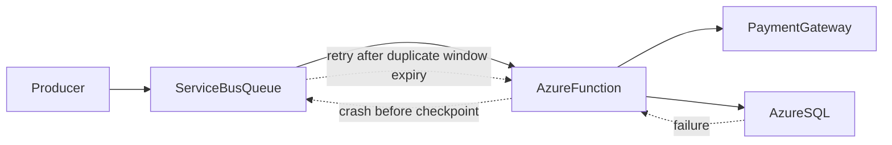
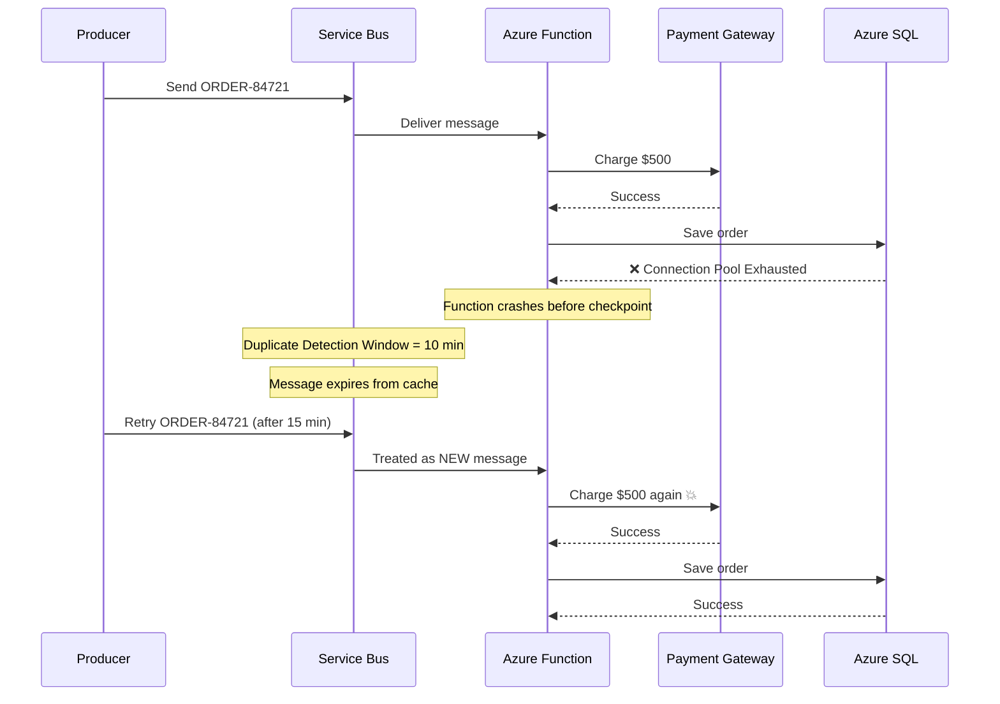
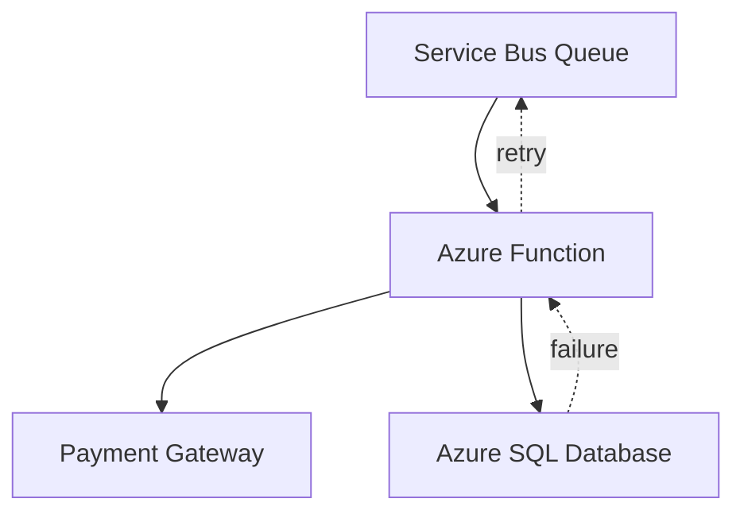
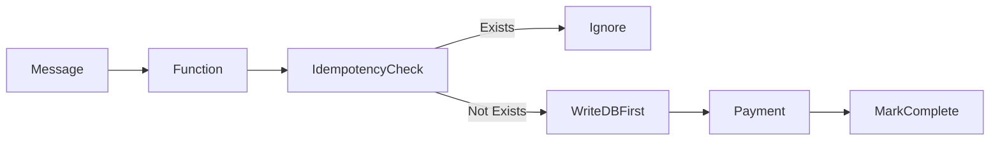

# 💥 Azure Service Bus Idempotency Failure Demo (Azure Functions .NET 8 Isolated)

This repository demonstrates a real-world distributed systems failure scenario where a customer is charged twice due to misunderstanding Azure Service Bus Duplicate Detection as idempotency.

---

# 🚨 Problem Statement

Azure Service Bus provides **Duplicate Detection Window**, but this is NOT idempotency.

When a function:

- Executes a side effect (payment)
- Crashes before checkpointing state
- And message is retried after duplicate window expiry

👉 The system executes the operation twice.

---

# 📁 Project Structure

```
AsbIdempotencyDemo/

│
├── AsbIdempotencyDemo.csproj
├── Program.cs
├── host.json
├── local.settings.json
│
├── Models/
│   └── OrderMessage.cs
│
├── Services/
│   ├── PaymentGateway.cs
│   ├── FakeSqlDatabase.cs
│   ├── IdempotencyStore.cs
│
├── Functions/
│   └── OrderProcessorFunction.cs
│
└── README.md
```

---

# 💣 Business Impact

| Expected | Actual |
|----------|--------|
| $500 charge | $1000 charge ❌ |

---

# 🧠 System Architecture



---

# ⏱️ Failure Timeline



---

# 🔥 Root Cause Analysis

## 1. Duplicate Detection ≠ Idempotency

Service Bus only prevents duplicate delivery within a **time window**.

It does NOT guarantee:

- Exactly-once processing
- Business-level correctness
- Cross-system transactional safety

---

## 2. Side Effects Before Persistence

The function performs:

1. Payment (external side effect)
2. Database write (fails)

If the function crashes between these steps:

👉 State is lost, but side effect remains.

---

## 3. Missing Idempotency Layer

No durable mechanism exists to detect:

- "Has this order already been processed?"

---

# 🧪 What This Demo Simulates

- Azure Service Bus Trigger Function
- Payment Gateway side effect
- Azure SQL failure simulation
- Function crash before checkpoint
- Retry after delay
- Duplicate detection expiry
- Double execution of payment

---

# 🧱 Architecture Overview



---

# 🧠 Key Insight

> Duplicate Detection is a broker-level memory feature — not a consistency guarantee.

---

# 💥 Correct vs Incorrect Mental Model

## ❌ Incorrect

Service Bus ensures:
- No duplicates
- Exactly-once processing

## ✅ Correct

Service Bus ensures:
- At-least-once delivery
- Possible duplicates after failure + retry
- Application must enforce idempotency

---

# 🧱 Fix Pattern (Conceptual)



---

# 🏃 Running the Project

## Prerequisites

- .NET 8 SDK
- Azure Functions Core Tools v4

---

## Run locally

```bash
func start
```

---

# 📩 Sample Message

```json
{
  "orderId": "ORDER-84721",
  "amount": 500
}
```

---

# 💥 Failure Output

```
First execution:
✔ Payment Success
❌ DB Failure
💥 Function Crash

Retry execution:
✔ Payment Success AGAIN
✔ DB Success

RESULT: DOUBLE CHARGE
```

---

# 🎯 Key Takeaway

If your system:

- Performs side effects
- Before durable state is written
- And relies on retry semantics

👉 You WILL eventually get duplicates in production.

---

# 🧩 Related Patterns

- Idempotency Key Store
- Outbox Pattern
- Poison Message Handling
- DLQ Replay Strategy
- Exactly-once illusion mitigation

---

# 📌 Final Insight

Service Bus guarantees delivery.

It does NOT guarantee correctness.

Correctness is an application-level responsibility.