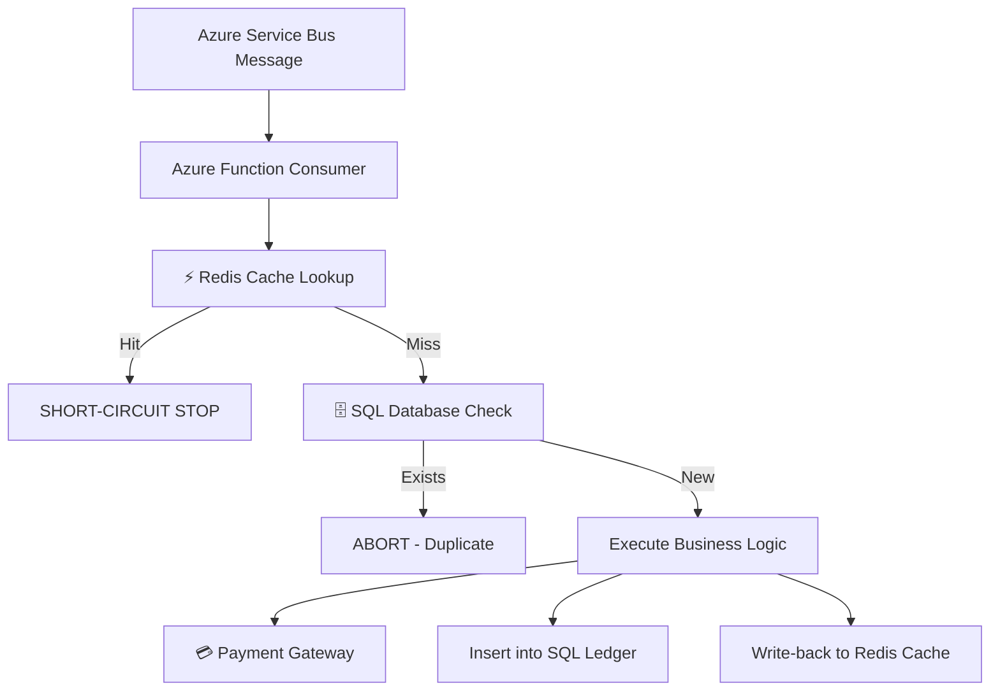
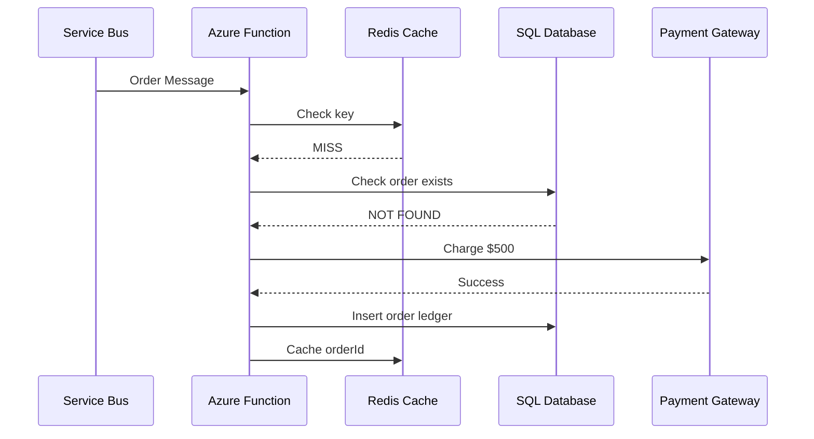

# ⚙️ Hybrid Idempotency Architecture (Redis + SQL) — Azure Functions .NET 8 Isolated

This repository demonstrates a **production-grade hybrid idempotency pattern** used in high-scale distributed systems:

> 🔥 Redis for performance (fast-path)  
> 🔒 SQL for correctness (strong consistency boundary)

---

# 📁 Project Structure

```
AsbHybridIdempotencyDemo/

│
├── AsbHybridIdempotencyDemo.csproj
├── Program.cs
├── host.json
├── local.settings.json
│
├── Models/
│   └── OrderMessage.cs
│
├── Services/
│   ├── RedisCacheService.cs
│   ├── SqlLedgerService.cs
│   ├── PaymentGateway.cs
│   └── HybridIdempotencyService.cs
│
├── Functions/
│   └── OrderProcessorFunction.cs
│
└── README.md
```

---

# 🧠 Architecture Overview



---

# ⚙️ Core Principle

> Performance layers are disposable.  
> Correctness layers must be durable.

---

# 💣 Problem This Solves

Without this pattern:

- Redis eviction causes duplicate processing
- Service Bus retries cause double charges
- Crash between cache and DB causes inconsistency

---

# 🔥 Hybrid Flow Explained

## 1. FAST PATH (Redis Layer)

```text
Check Redis:
✔ Found → Skip processing immediately (microsecond response)
❌ Miss → Proceed to SQL
```

### Why Redis?

- Extremely fast (sub-ms latency)
- Reduces DB load
- Handles hot-key deduplication

---

## 2. STRONG PATH (SQL Layer)

```text
Check SQL unique constraint:
✔ Exists → STOP (true correctness)
❌ Not Exists → Proceed
```

### Why SQL?

- ACID guarantees
- Survives cache eviction
- Source of truth

---

## 3. WRITE-BACK SYNC

After successful processing:

- Insert into SQL ledger
- Populate Redis cache

---

# 💥 Failure Scenarios Prevented

## ❌ Redis-only system fails when:

- Cache expires
- Node restart clears memory
- Partition loss occurs

## ❌ SQL-only system fails when:

- High DB load
- Expensive repeated reads

---

# 🧱 Execution Flow



---

# 🧠 Key Insight

> Redis optimizes speed.  
> SQL guarantees truth.

Neither alone is sufficient in distributed systems.

---

# ⚙️ Project Components

## 1. RedisCacheService

- Fast lookup
- TTL-based eviction simulation

## 2. SqlLedgerService

- Unique constraint enforcement
- Source-of-truth store

## 3. HybridIdempotencyService

Orchestrates:

- Cache check
- DB validation
- Write-through logic

---

# 🏃 Running the Project

## Prerequisites

- .NET 8 SDK
- Azure Functions Core Tools v4
- Redis (optional local emulator)
- SQL Server (or in-memory simulation fallback)

---

## Run locally

```bash
func start
```

---

# 📩 Sample Message

```json
{
  "orderId": "ORDER-84721",
  "amount": 500
}
```

---

# 💥 Expected Output

```text
Redis MISS
SQL MISS
Processing payment...
Insert into SQL ledger
Write to Redis cache
```

---

# 🎯 Key Takeaway

> Correctness must survive cache loss.  
> Performance must never violate correctness.

---

# 🧩 Architectural Patterns Used

- Cache-Aside Pattern
- Idempotency Key Store
- SQL Unique Constraint Guard
- Write-through Cache
- Event-driven processing

---

# 🚀 Why This Pattern Matters

This architecture is used in:

- FinTech payment pipelines
- Order processing systems
- High-throughput event ingestion systems
- Multi-region distributed services

---

# 📌 Final Insight

If Redis is your only guardrail:

👉 you WILL eventually double-process events.

If SQL is your only guardrail:

👉 you WILL eventually hit latency bottlenecks.

Hybrid systems are the equilibrium point.