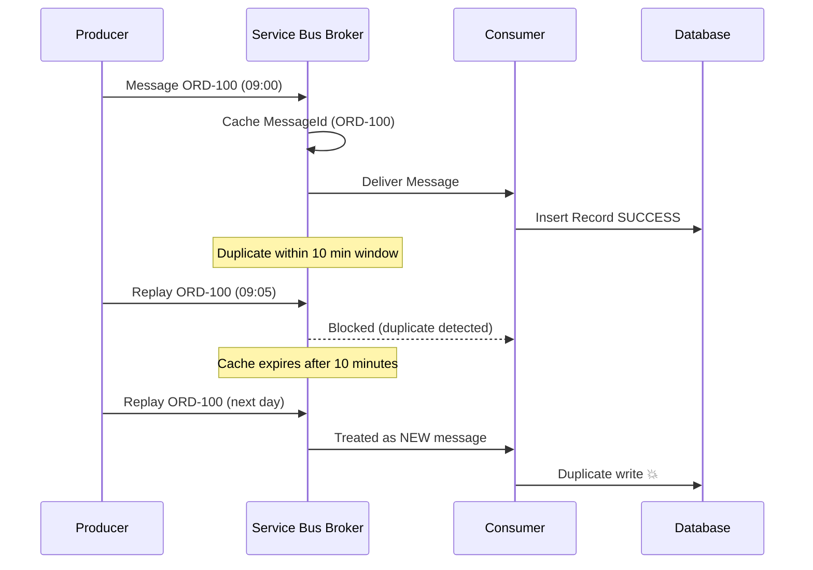
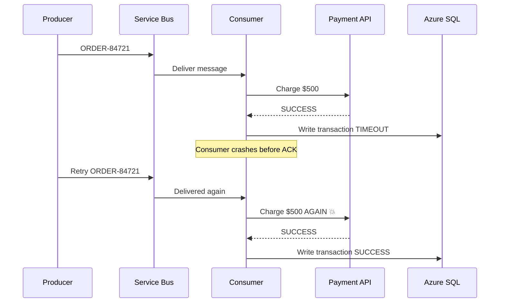
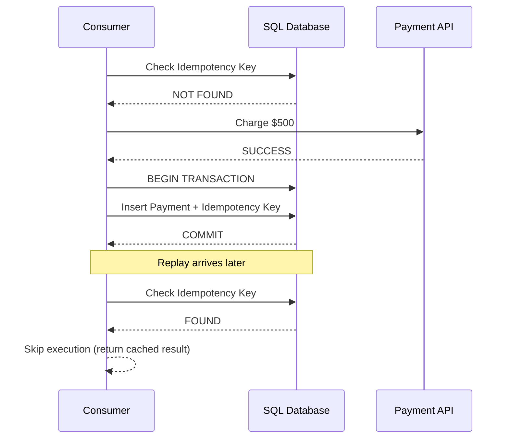

# 🔥 Idempotency & Duplicate Detection in Distributed Systems

A deep dive into **Service Bus duplicate detection**, **idempotency failures**, and **correct architectural patterns** for building financially correct distributed systems.

---

# ❌ THE DUPLICATE DETECTION ILLUSION (Time-Bound Window)

> Service Bus Duplicate Detection is NOT idempotency. It is a **temporary broker-side cache optimization**.

## Configuration
- DuplicateDetectionWindow = 10 Minutes

> 💡 Broker deduplication is temporary memory — NOT a correctness guarantee.

💥 FINANCIAL FAILURE MODE (REPLAY + CRASH)

❗ Outcome:

Expected: $500
Actual: $1000 ❌

🧠 IDEMPOTENCY KEY PATTERN (CORRECT MODEL)

