# ⚙️ Azure Service Bus Prefetch & Concurrency Tuning Model  
## (Stop-and-Go vs Continuous Pipelining)

This document explains how **Prefetch Count, Batch Size, and Concurrency settings** affect throughput, starvation, and system efficiency in Azure Service Bus + Azure Functions.

---

# ❌ The Bad State: Stop-and-Go Starvation

## Configuration

```
Prefetch = 100
Batch Size = 100
```

---

## Problem

- Worker consumes entire buffer instantly
- Network thread becomes idle while refilling
- CPU and network operate sequentially instead of in parallel

---

## System Flow (Bad State)

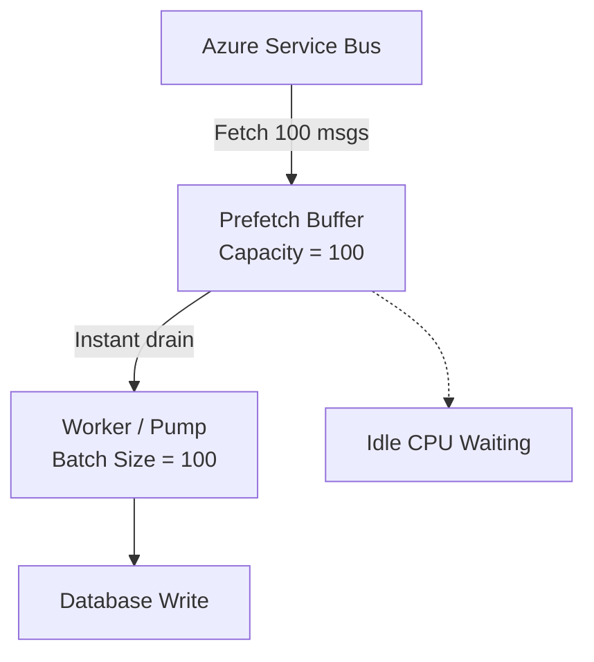

---

## Outcome

- CPU starvation cycles
- Poor throughput
- High latency variance
- No overlap between compute and network

---

# ✅ The Good State: Continuous Pipelining

## Configuration

```
Prefetch = 2000
Batch Size = 100
```

---

## Key Idea

> Prefetch becomes a sliding buffer, not a batch unit.

Network and CPU run in parallel.

---

## System Flow (Good State)

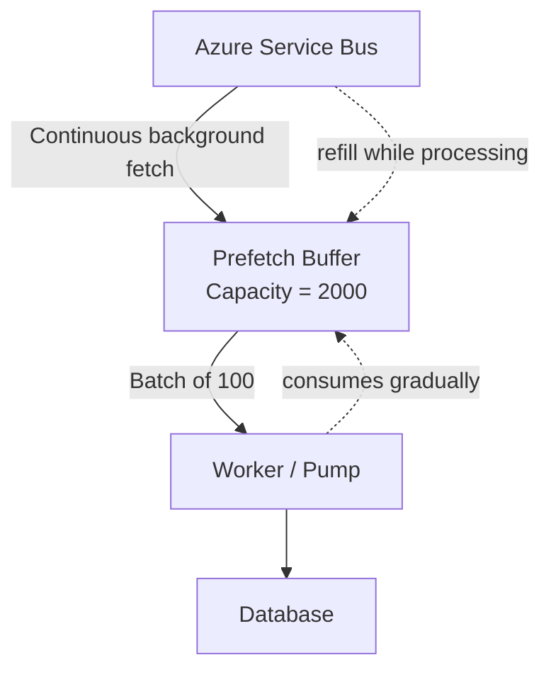

---

## Result

- CPU always busy
- Network always refilling buffer
- No idle cycles
- Stable throughput

---

# ⚠️ Critical Misconception

## Prefetch is NOT a batch size

Many assume:

> Prefetch = work chunk size

❌ Wrong

---

## Correct Model

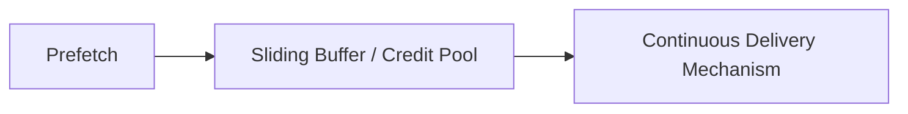

---

# 🔄 AMQP Credit-Based Flow Control

Azure Service Bus uses AMQP internally:

- SDK issues "credits"
- Broker sends messages based on available credit
- Credits are replenished continuously

---

## Flow Control Model

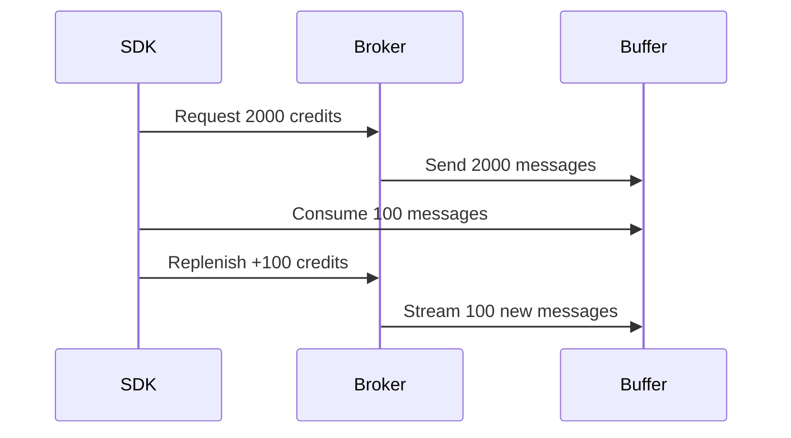

---

## Float Valve Analogy

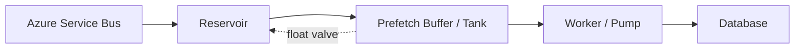

---

# ⚠️ Edge Cases

---

## Case A: Slow Worker (Backpressure)

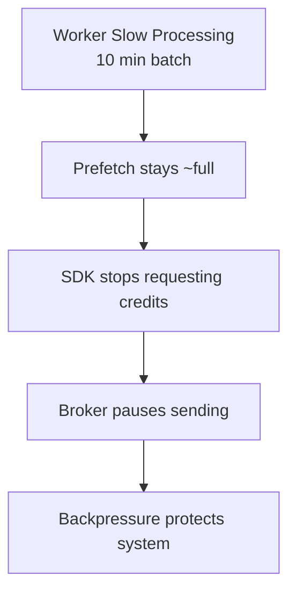

### Outcome

- Prevents memory overflow
- Automatically throttles broker
- Stabilizes system

---

## Case B: Empty Queue

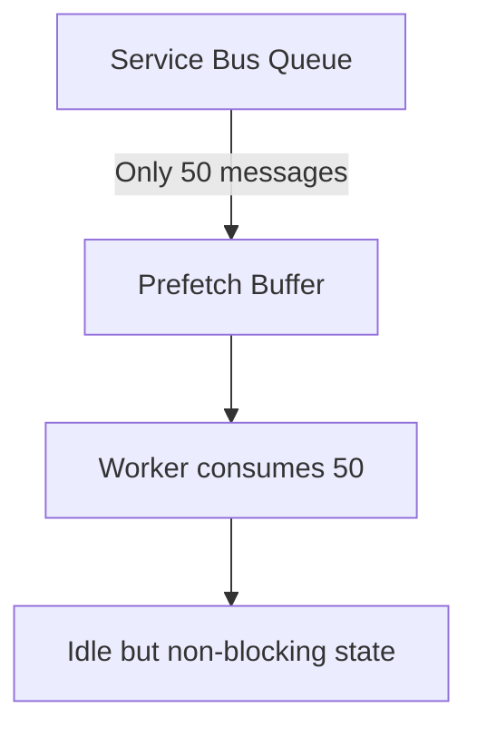

### Outcome

- No blocking
- Immediate processing of new messages

---

# 📊 Adaptive Decision Tree

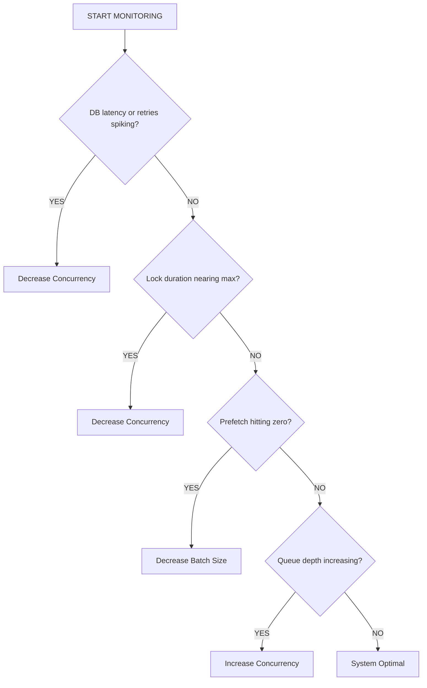

---

# ⚙️ Tuning Levers

---

## 🔻 Decrease Concurrency

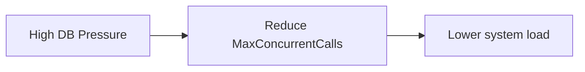

---

## 🔻 Decrease Batch Size

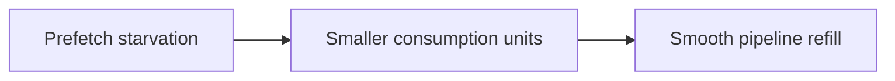

---

## 🔺 Increase Concurrency

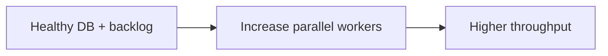

---

# 🧠 Core Insight

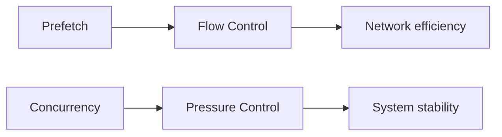

---

# 🚀 Final Principle

A correctly tuned system ensures:

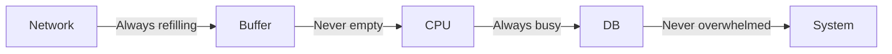

---

# 📌 Summary

| Configuration | Behavior |
|--------------|----------|
| Prefetch = Batch Size | Stop-and-go starvation |
| Prefetch >> Batch Size | Continuous pipelining |
| Poor tuning | Idle CPU cycles |
| Optimal tuning | Full resource utilization |

---

# 🎯 Final Insight

> If CPU and network are taking turns, your system is not compute-bound — it is pipeline-bound.
