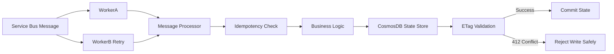
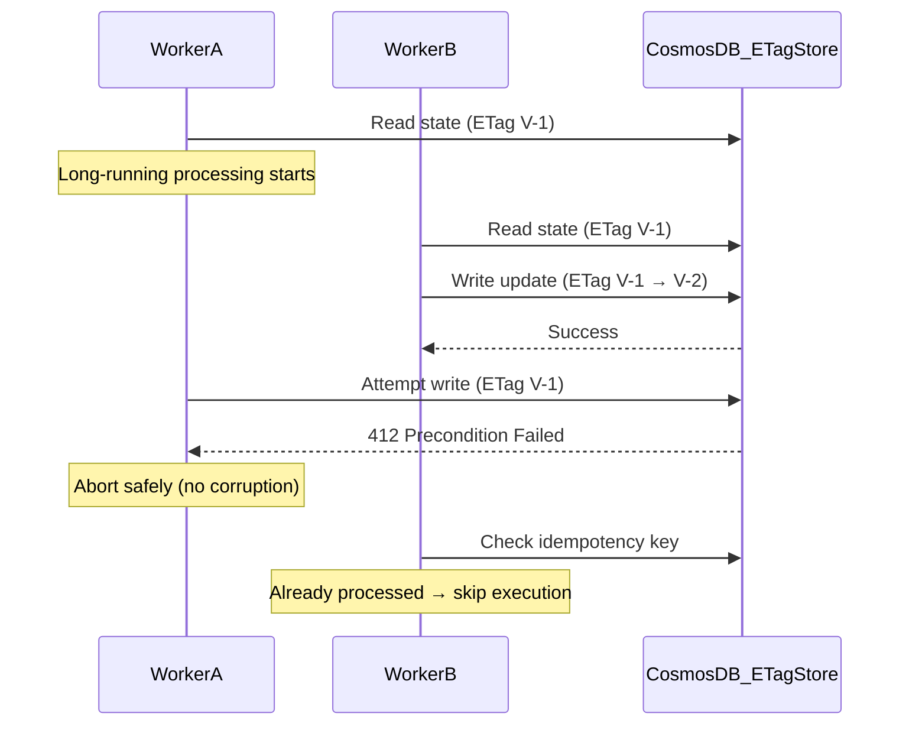

# 🛡️ Idempotency Shield with Optimistic Concurrency
## Azure Service Bus + Cosmos DB Safe Processing Architecture

---

# 📌 Overview

This architecture demonstrates how to safely process at-least-once messages from Azure Service Bus while preventing:

- Duplicate processing
- Race conditions between concurrent workers
- Lost updates in distributed systems
- Corruption caused by retries and lock expiry

It combines two core patterns:

- Idempotency (business logic protection)
- Optimistic concurrency using ETag (state protection)

---

# 🎯 Problem Statement

In Azure Service Bus systems:

- Messages are delivered at least once
- Locks can expire during long processing
- Multiple workers may process the same message

This leads to:

- Double processing
- Incorrect financial updates
- Overwritten state
- Non-deterministic behavior

---

# 🧠 Solution Strategy

We enforce correctness using two independent safety layers:

## 1. Idempotency Layer
Prevents duplicate execution of business logic.

## 2. Optimistic Concurrency Layer (ETag)
Prevents stale writes from overwriting newer state.

---

# 🏗️ Architecture Overview

---

# 🔁 Runtime Execution Flow

---

# ⚙️ Internal Processing Model

1. Message arrives from Azure Service Bus
2. Worker reads current state
3. Idempotency check is performed
4. If new → business logic executes
5. State is updated using ETag
6. If stale → write rejected (HTTP 412)
7. Retry path performs fast deduplication exit

---

# 🧩 Key Components

## Idempotency Check

If messageId exists in ProcessedMessages → skip execution

## Optimistic Concurrency (ETag)

If-Match: ETag  
Match → update succeeds  
Mismatch → reject (412)

## Retry Behavior

First execution → business logic runs  
Second execution → no-op

---

# ☁️ Azure Mapping

| Concept | Azure Equivalent |
|--------|-----------------|
| InMemoryStore | Azure Cosmos DB container |
| ETag | Cosmos DB _etag |
| ProcessedMessages | Idempotency store (Cosmos DB / Redis) |
| Worker simulation | Azure Functions (Service Bus trigger) |

---

# 🚨 Failure Scenarios Handled

## Without this pattern
- Duplicate processing
- Double financial deductions
- Race-condition overwrites
- Lost updates

## With this pattern
- Exactly-once effect (not delivery)
- Safe retries
- Deterministic state transitions
- Race-condition immunity

---

# 🧠 Mental Model

Service Bus guarantees at-least-once delivery  
This system guarantees exactly-once effect

---

# 🔄 Why Two Layers Are Required

Idempotency alone cannot prevent concurrent overwrite  
ETag alone cannot prevent duplicate execution  

Combined → Safe execution + safe persistence

---

# 📊 When to Use This Pattern

- Payment systems
- Order processing pipelines
- Inventory systems
- Event-driven microservices

---

# ⚡ Key Takeaway

Retries are inevitable.  
Duplicates are inevitable.  
Concurrency is inevitable.  

So correctness must be designed, not assumed.
