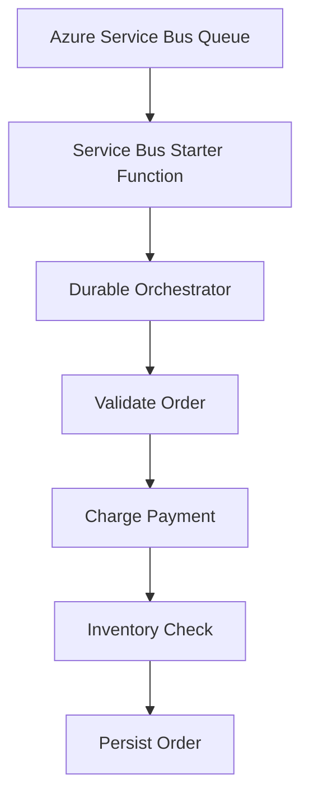

# Azure Service Bus + Durable Functions Orchestration Demo

> Learn how to solve long-running Azure Service Bus processing problems using Durable Functions.

---

# What Problem Are We Solving?

Many developers start with a simple Azure Service Bus Trigger:

```text
Service Bus Message
        │
        ▼
Azure Function
        │
        ├── Call Payment API (45 sec)
        ├── Wait for Inventory (30 sec)
        ├── Save to Database (20 sec)
        │
        ▼
Complete Message
```

At first this looks fine.

However, Service Bus locks are temporary.

If processing takes too long:

- Message lock can expire
- Another worker can receive the same message
- Duplicate processing can occur
- Session ownership can be lost
- Throughput decreases
- Auto-lock renewal becomes difficult to manage

Many teams try to solve this by increasing:

```text
MaxAutoLockRenewalDuration
```

But this only treats the symptom.

The real issue is that Service Bus is being used as a workflow engine.

It isn't one.

---

# The Architectural Shift

Instead of performing the work inside the Service Bus Function:

```text
Receive Message
      │
      ▼
Do Everything Here
```

We move to:

```text
Receive Message
      │
      ▼
Start Durable Workflow
      │
      ▼
Complete Message Immediately

Durable Workflow
      │
      ├── Step 1
      ├── Step 2
      ├── Step 3
      └── Step 4
```

This completely separates:

- Message Transport
- Workflow Execution

---

# High-Level Architecture

```text
┌─────────────────────┐
│ Azure Service Bus   │
└──────────┬──────────┘
           │
           ▼
┌─────────────────────┐
│ Starter Function    │
│ (Fast)              │
└──────────┬──────────┘
           │
           ▼
┌─────────────────────┐
│ Durable             │
│ Orchestrator        │
└──────────┬──────────┘
           │
           ▼
 ┌───────────────────┐
 │ Validate Order    │
 └───────────────────┘
           │
           ▼
 ┌───────────────────┐
 │ Charge Payment    │
 └───────────────────┘
           │
           ▼
 ┌───────────────────┐
 │ Inventory Check   │
 └───────────────────┘
           │
           ▼
 ┌───────────────────┐
 │ Save Order        │
 └───────────────────┘
```

---

# Project Structure

```text
Durable-ServiceBus-Orchestration-Demo
│
├── src
│
│   ├── Program.cs
│   ├── host.json
│   ├── local.settings.json
│   ├── DurableServiceBusDemo.csproj
│
│   ├── Functions
│   │
│   │   ├── ServiceBusStarterFunction.cs
│   │   ├── OrderOrchestrator.cs
│   │   └── OrderActivities.cs
│   │
│   ├── Models
│   │
│   │   ├── OrderMessage.cs
│   │   └── PaymentResult.cs
│   │
│   └── Services
│
│       ├── PaymentGatewayClient.cs
│       └── OrderRepository.cs
│
└── README.md
```

---

# Understanding Each File

## Program.cs

This is the application's startup file.

Responsibilities:

- Configure Dependency Injection
- Register services
- Configure Application Insights
- Start Azure Functions Host

Think of it as:

```text
Application Bootstrapper
```

---

## ServiceBusStarterFunction.cs

This is the most important file in the architecture.

Responsibilities:

```text
Receive Message
Deserialize Message
Start Orchestration
Exit
```

What it should NOT do:

```text
Call APIs
Write Databases
Wait
Retry
Perform Business Logic
```

Analogy:

```text
Restaurant Receptionist

Customer arrives
↓
Seat customer
↓
Leave

The receptionist doesn't cook food.
```

---

## OrderOrchestrator.cs

This is the workflow manager.

Responsibilities:

```text
Step 1
Step 2
Step 3
Step 4
```

The orchestrator coordinates work.

It does not perform work itself.

Think of it as:

```text
Project Manager
```

---

## OrderActivities.cs

Activities perform actual business work.

Examples:

```text
Validate Order
Charge Payment
Reserve Inventory
Persist Order
```

Think of them as:

```text
Workers
```

---

## PaymentGatewayClient.cs

Simulates:

```text
Stripe
PayPal
Banking API
```

In our demo:

```text
45 second delay
```

to mimic a slow external dependency.

---

## OrderRepository.cs

Simulates:

```text
SQL Server
Cosmos DB
PostgreSQL
```

In our demo:

```text
20 second delay
```

to mimic persistence operations.

---

# Message Flow

A message arrives:

```json
{
  "orderId": "ORD-1001",
  "sessionId": "SESSION-123",
  "customerId": "CUSTOMER-1",
  "amount": 499.95
}
```

## Step 1

Service Bus Trigger receives message.

```text
Message Received
```

## Step 2

Starter Function launches orchestration.

```text
OrderOrchestrator
```

## Step 3

Message is immediately completed.

```text
Service Bus queue becomes empty
```

This usually happens in:

```text
< 1 second
```

## Step 4

Durable Workflow continues.

```text
Validate Order
↓
Charge Payment
↓
Wait For Inventory
↓
Persist Order
```

## Step 5

Workflow completes successfully.

---

# Why This Works

Without Durable Functions:

```text
Service Bus Lock
      │
      ├── API Call
      ├── Retry
      ├── Wait
      ├── Save
      │
      ▼
Complete
```

Everything depends on the lock staying alive.

With Durable Functions:

```text
Service Bus Lock
      │
      ▼
Start Workflow
      │
      ▼
Complete Message

Durable Runtime
      │
      ├── Saves State
      ├── Handles Retries
      ├── Tracks Progress
      ├── Resumes Execution
      └── Recovers Failures
```

The lock is no longer the bottleneck.

---

# Durable Functions Superpower

Suppose the workflow reaches:

```text
Charge Payment
```

after 45 seconds.

The Function App crashes.

Traditional approach:

```text
Entire process restarts
```

Potential duplicate work.

Durable Functions:

```text
Workflow state persisted
```

After restart:

```text
Resume from last checkpoint
```

instead of starting over.

---

# Real World Scenarios

## E-Commerce

Customer places order.

Workflow:

```text
Validate Order
↓
Fraud Check
↓
Payment
↓
Reserve Inventory
↓
Create Shipment
↓
Send Confirmation
```

Duration:

```text
30 seconds to several minutes
```

Excellent Durable Functions use case.

---

## Insurance Claims

Customer submits claim.

Workflow:

```text
Validate Documents
↓
Fetch External Data
↓
Risk Assessment
↓
Human Approval
↓
Claim Processing
```

Duration:

```text
Minutes to Days
```

Durable Functions was designed for this.

---

## Financial Transactions

Workflow:

```text
Receive Payment
↓
AML Validation
↓
Bank Verification
↓
Settlement
↓
Ledger Update
```

Duration:

```text
Several minutes
```

Avoid keeping Service Bus locks alive.

---

## Logistics

Workflow:

```text
Order Received
↓
Warehouse Allocation
↓
Carrier Selection
↓
Shipment Booking
↓
Tracking Creation
```

Multiple systems.

Multiple dependencies.

Perfect orchestration candidate.

---

# How To Run Locally

## Prerequisites

Install:

### .NET 8 SDK

```bash
dotnet --version
```

### Azure Functions Core Tools

```bash
func --version
```

### Azurite

Used for local Durable Function state storage.

### Azure Service Bus

Create:

```text
Namespace
└── Queue: orders
```

---

# Configure local.settings.json

```json
{
  "IsEncrypted": false,
  "Values": {
    "AzureWebJobsStorage": "UseDevelopmentStorage=true",
    "FUNCTIONS_WORKER_RUNTIME": "dotnet-isolated",
    "ServiceBusConnection": "<connection-string>"
  }
}
```

---

# Build

```bash
dotnet restore

dotnet build
```

---

# Run

```bash
func start
```

Expected:

```text
Functions:

ServiceBusStarterFunction
OrderOrchestrator
ValidateOrder
ChargePayment
WaitForInventory
PersistOrder
```

---

# How To Test

Send a message into:

```text
orders
```

Queue.

Example:

```json
{
  "orderId": "ORD-1001",
  "sessionId": "SESSION-123",
  "customerId": "CUSTOMER-1",
  "amount": 499.95
}
```

---

# Expected Logs

Immediately:

```text
Message received
Starting orchestration
Orchestration started
```

Queue becomes empty.

45 seconds later:

```text
Charging payment
Payment completed
```

75 seconds later:

```text
Inventory confirmed
```

95 seconds later:

```text
Persisting order
Workflow completed
```

---

# Common Beginner Questions

## Why not just increase lock duration?

Because lock duration treats the symptom.

It doesn't solve:

- Complex workflows
- Checkpointing
- State management
- Recovery
- Orchestration

---

## Why not use retries only?

Retries help with failures.

They don't help with:

```text
Workflow State
Long-running Processes
Human Interaction
Multi-step Coordination
```

---

## When should I move to Durable Functions?

A practical rule:

If processing regularly exceeds:

```text
5-10 seconds
```

or contains:

```text
Multiple Steps
External APIs
Human Approvals
Long Waits
Complex Retries
```

evaluate Durable Functions.

---

# Key Takeaway

Azure Service Bus is a messaging platform.

Durable Functions is a workflow engine.

When developers try to turn Service Bus into a workflow engine, they start fighting:

- Lock expirations
- Duplicate processing
- Auto-lock renewal
- Session ownership
- Retry complexity

The architectural shift is simple:

```text
Use Service Bus
for transportation.

Use Durable Functions
for orchestration.
```

Once you separate those responsibilities, long-running workflows become significantly more reliable, scalable, and easier to reason about.

## Architecture


